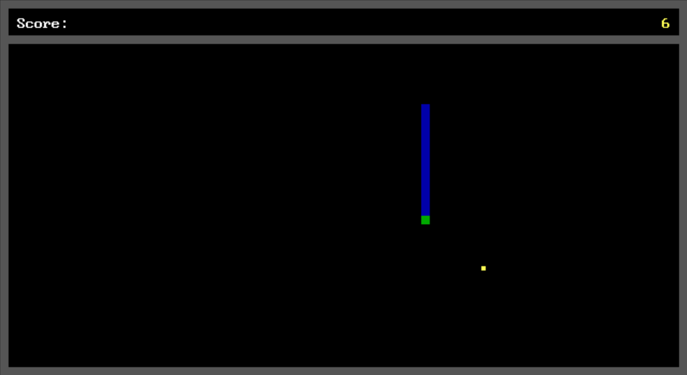

# Snakg
This is just another [Snake](https://en.wikipedia.org/wiki/Snake_(video_game_genre)) clon,
written in [x86](https://en.wikipedia.org/wiki/X86) [Assembly](https://en.wikipedia.org/wiki/Assembly_language)
and translated into machine code by [TASM](https://en.wikipedia.org/wiki/Turbo_Assembler).
__
The 'g' intead of an 'e' at the end is just a mirrored 'e', to mark this game as a clone.
So it has no special meaning.

## Requirements
Requires [MS-DOS](https://en.wikipedia.org/wiki/MS-DOS) 2.0 or higher.
Tested with [DOSBox](https://www.dosbox.com) 0.74-3.

## License
This project is free software under the terms of the MIT license.  
For more details please see the LICENSE file or: https://opensource.org/licenses/MIT

## Credits
 * Created by: Vivien Richter <vivien-richter@outlook.de>
 * Git repository: https://github.com/vivi90/snakg.git
